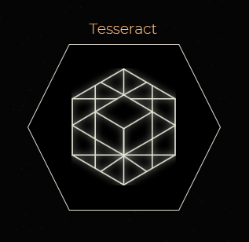

# Run Harmonic Regression Using Tesseract

 

Harmonic regression is a type of time series analysis that is commonly used in forestry and agriculture. It looks for temporal paterns that repeat over a well defined time interval, in this case yearly. Harmonic regression can be used to understand the trends in certain patterns of spectral data as well as predict out into the future for use in vegetation management, forest health and land cover modeling. This technique is commonly used by the US Forest Service in order to understand the health and seasonal changes of forest inventories. While most often used for vegetation, harmonic regression can be used for modeling any kind of temporal patter that repeats in regular intervals.

In this example we will fit a Fourier series to Landsat-8 data using the Geodesic Platform. The Landsat data is located on Google Earth Engine and we will use a boson to add it to the Geodesic Knowledge Graph which will allow the Tesseract Computation Engine to reach out and gather the data, then process it at scale. In the modeling step we first transform the first 6 spectral bands of Landsat data with the Tasseled Cap Transformaion (TCT). This takes the spectral bands and extracts 3 new bands from them called brightness, greenness, and wetness. We then fit an n-th order Fourier Series to the transormed data. The parameters we are looking for are the coefficients of the following series:

$$ A_{i} = 1 + t_i + \sum\limits_{k=1}^{n} \sin(\frac{2\pi k t_i}{P}) +  \sum\limits_{k=1}^{n} \cos(\frac{2\pi k t_i}{P})  $$

An example of this type of fit can be seen below. This is a simple Sine function with a linear term that has a 4th order Fourier series fit using the least squares regression method.

In reality the data is much messier than this nice Sine function. Landsat data can have clouds, bad pixels and even completely missing data. Below is an example of a Fourier series fit to this noisy, unfiltered Landsat data.

### 5 Years of Landsat Data

This shows a fit over about 5 years of Landsat data but only for a single pixel. In practice you must fit a series for every pixel in the area and store all of the parameters as a multidimensional array of data. This is where Tesseract comes in. Tesseract allows us to gather the data, split it into chunks, then efficiently process each of the chunks. Because Tesseract treats time as a first class citizen, we are able to accomidate many kinds of spatial, temporal and spatio-temporal analytics easily. In this analysis we perform more than 2.2 million fits across 200 time steps.

## Fitting Using Least Squares Regression

Because we are fitting a Fourier series to the data, we can use the least squares regression method to find the coefficients of the series. This is a simple linear algebra problem that can be solved using the following equation:

$$ Ax = B $$
    
Where $A$ is a matrix of the Fourier series, $x$ is a vector of the coefficients and $B$ is a vector of the transformed data. However, in the case of Landsat data, we cannot use a normal
least squares regression because of missing data. Some time steps will be empty as the collection schedule for the satellites is not exact, and occasionally data will be missing due to clouds or other atmospheric conditions. In order to solve this problem we use a masked version of the least squares regression. For a detailed derivation of this method, see the [Solving Least Squares Regression with Missing Data](https://alexhwilliams.info/itsneuronalblog/2018/02/26/censored-lstsq/). The equation we will solve is:

$$ A^T (M \cdot (AX)) = A^T (M \cdot B) $$

Where $A$ is the Fourier series matrix, $B$ is the transformed data, $M$ is a mask of the data, and $X$ is the vector of coefficients. The mask is a matrix of 1's and 0's where 1's represent valid data and 0's represent missing data. This can easily be solved by numpy's `linalg.solve` function.

## Repo Contents

### `HarmonicRegressionDemo.ipynb`

This notebook explains the process of harmonic regression and shows some simple tests.

### `submit_model.ipynb`

This notebook contains the Tesseract Job description and submits the job.

### `harmonic_regression.py`

The main harmonic regression code that runs using the Tesseract SDK. This is the file that is the entrypoint
to the container run in the tesseract job.